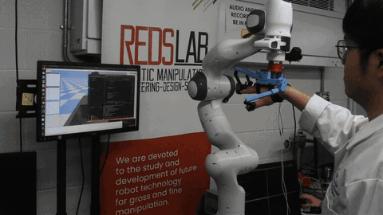
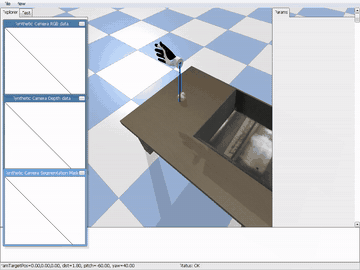
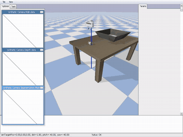
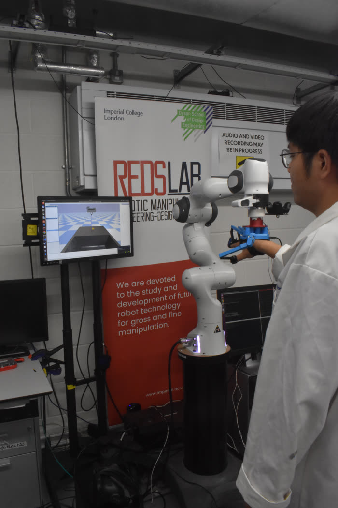
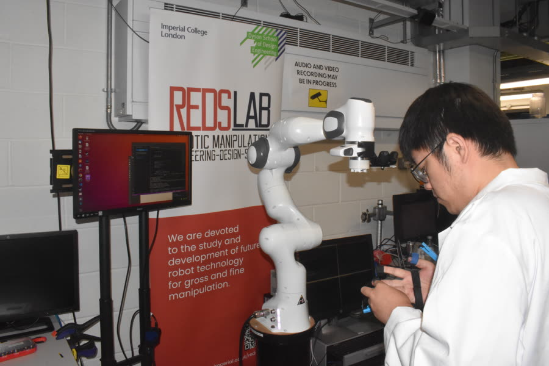
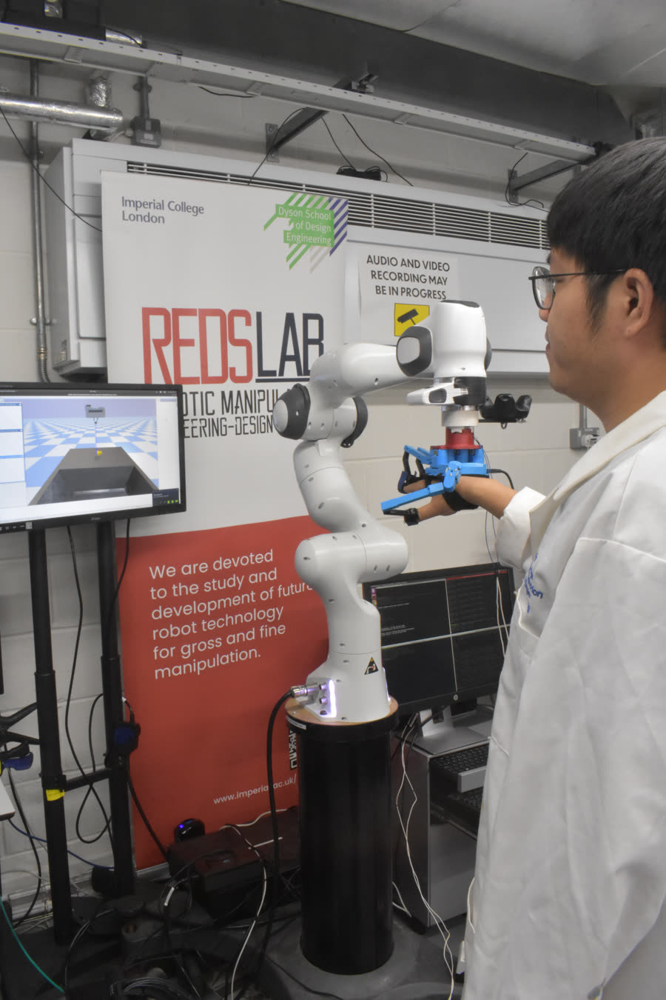

# Immersive Demonstrations are the Key to Imitation Learning

Code and data for the paper *Immersive Demonstrations are the Key to Imitation Learning* (Kelin Li, Digby Chappell and Nicolas Rojas, ICRA 2023).

The repository contains the demonstration platform: manipulation demonstrations are collected in a PyBullet scene with a **SenseGlove** haptic glove and an **HTC Vive Tracker**, with or without force feedback to the demonstrator. It also contains the demonstrations collected in the user study and the behaviour-cloning scripts.

The demonstrator's wrist pose (Vive Tracker) and finger joints (SenseGlove) drive a simulated end-effector. Contact forces computed in simulation are rendered back to the demonstrator's fingers through the glove's brakes. Three end-effectors are supported: a 20-DoF human hand, the Franka parallel gripper, and the RUTH hand.

<p align="center">
  
</p>

| Human hand (`mano`) | Franka gripper (`franka`) | RUTH hand (`RUTH`) |
|:---:|:---:|:---:|
|  |  |  |

---

## 1. Hardware

| Component | Role | Notes |
|---|---|---|
| SenseGlove DK1 (right hand) | Finger joint sensing; per-finger force feedback (5 brake channels, command range 0–100) | USB connection |
| HTC Vive Tracker + 2× SteamVR base stations | 6-DoF wrist pose | Must appear in SteamVR as `tracker_1` |
| Linux PC with a display | Runs PyBullet, the glove library and SteamVR | Developed on Ubuntu with Python 3.8 |
| Franka Emika Panda (**optional**) | Renders the wrist force to the demonstrator's arm (`panda_flag = True`) | The glove is mounted on the Panda flange through a 3D-printed bracket. Needs a separate robot-side program listening on TCP; see §6 |

<p align="center">
  
  &nbsp;
  
</p>

*Left: the full setup. The monitor shows the PyBullet scene, the demonstrator wears the SenseGlove, and (optional configuration) the hand is coupled to the Panda flange. Right: fitting the glove before calibration.*

The Panda is **not** required. With `panda_flag = False` the system is just the glove, the tracker and the PC, and this is the configuration used for the `force` / `no_force` comparison.

---

## 2. Repository layout

`SenseGlove-API-master/` (SenseGlove SDK, Linux libraries only) and `GraspIt2URDF-master/` (human-hand URDF and meshes) are third-party and keep their own licences. `demonstrations/*/triad_openvr.py` is from [triad_openvr](https://github.com/TriadSemi/triad_openvr).

```
demonstrations/
  mano/    mano_pybullet_nopanda.py    utils.py  evaluation.py  data/  video/
  franka/  franka_pybullet_nopanda.py  utils.py  evaluation.py  data/  video/
  RUTH/    ruth_pybullet_nopanda.py    utils.py  evaluation.py  data/  video/  urdf/
  Participants.txt
SenseGlove-API-master/Core/SGCoreCpp/examples/StandaloneCpp/
  SenseGlove.cpp            C wrapper around the SenseGlove SDK
  build_senseglove.sh       builds libsenseglove.so and installs it
behavioral_cloning/          behaviour-cloning training and test scripts, custom gym envs in envs/
GraspIt2URDF-master/         HumanHand20DOF.urdf and its meshes
docs/media/                  images used in this README
```

---

## 3. Installation

### 3.1 System packages

```bash
sudo apt install build-essential g++ python3-pip
```

Install **Steam** and **SteamVR**, pair the Vive Tracker, and check that it is tracked before running anything. If no headset is connected, enable SteamVR's null driver (`"requireHmd": false` in `steamvr.vrsettings`).

### 3.2 Python packages

```bash
python3 -m venv .venv && source .venv/bin/activate   # Python 3.8 was used originally
pip install pybullet numpy scipy pandas matplotlib openvr
pip install torch        # only for the behaviour-cloning scripts
```

`triad_openvr.py` (Vive Tracker wrapper) is already copied into each `demonstrations/<gripper>/` folder.

### 3.3 Paths to edit

Several absolute paths still point to the original machine (`/home/kelin/workspace_kelin/RAL-ICRA2023/...`). Replace them with your clone location:

| File | Line | What it is |
|---|---|---|
| `GraspIt2URDF-master/urdf/HumanHand20DOF.urdf` | all `<mesh>` tags | Mesh files (`GraspIt2URDF-master/data/HumanHand20DOF/*.stl`) |
| `demonstrations/mano/mano_pybullet_nopanda.py` | 59 | Human-hand URDF (`GraspIt2URDF-master/urdf/HumanHand20DOF.urdf`) |
| `demonstrations/RUTH/ruth_pybullet_nopanda.py` | 59 | RUTH URDF (`demonstrations/RUTH/urdf/urdf/RUTH.urdf`) |
| `demonstrations/{mano,franka,RUTH}/utils.py` | 49–51 | Where the glove calibration is saved |

A quick way, run from the repository root:

```bash
grep -rl "/home/kelin/workspace_kelin/RAL-ICRA2023" demonstrations GraspIt2URDF-master/urdf | \
  xargs sed -i "s#/home/kelin/workspace_kelin/RAL-ICRA2023#$(pwd)#g"
```

---

## 4. Usage

### Step 1: Build `libsenseglove.so`

The Python scripts talk to the glove through a small C interface (`connect`, `get_hand_joints`, `force_feedback`, `disconnect`) loaded with `ctypes`. Build it once:

```bash
cd SenseGlove-API-master/Core/SGCoreCpp/examples/StandaloneCpp
./build_senseglove.sh
```

This compiles `SenseGlove.cpp` against the SDK libraries shipped in `SenseGlove-API-master/Core/{SGCoreCpp,SGConnect}/lib/linux/Release`, then copies `libsenseglove.so`, `libSGCoreCpp.so` and `libSGConnect.so` into `demonstrations/mano`, `demonstrations/franka` and `demonstrations/RUTH`. The library is linked with `rpath=$ORIGIN`, so no `LD_LIBRARY_PATH` is needed as long as the three files stay together.

The equivalent manual command is:

```bash
g++ -std=c++11 -O2 -shared -fPIC SenseGlove.cpp \
    -I. -I../../incl -I../../../SGConnect/incl \
    -L../../lib/linux/Release -L../../../SGConnect/lib/linux/Release \
    -lSGCoreCpp -lSGConnect -Wl,-rpath,'$ORIGIN' -o libsenseglove.so
```

If the glove is not detected, add your user to the `dialout` group (`sudo usermod -aG dialout $USER`, then log out and in).

### Step 2: Calibrate the SenseGlove

Calibration is per demonstrator and is built into the collection script. In the `__main__` block of the script for your gripper, set:

```python
demonstrator      = 'P01'     # identifier used in all file names
glove_calibration = True      # run calibration on start
```

Run the script (Step 3). After the glove connects you will see:

```
Calibrate the glove, press any button to start:
```

1. Put on the glove, press **Enter**.
2. For the next 500 samples, **fully open and fully close the hand several times, and move the thumb through its whole range**. A progress bar is shown.
3. For every one of the 21 channels, the mean of the 10 largest and the 10 smallest readings is taken as its range.

The result is written to `data/glove_calibration/<demonstrator>.npy` in all three gripper folders (first 21 values: range, last 21: minimum). For later sessions with the same person, set `glove_calibration = False` and the stored file is loaded instead.

<p align="center">
  
</p>

### Step 3: Collect demonstrations

Choose the settings in the `__main__` block:

| Setting | Values | Meaning |
|---|---|---|
| `demonstrator` | string | Participant identifier |
| `force` | `'force'` / `'no_force'` | Whether contact force is rendered to the glove. Also selects the output folder |
| `glove_calibration` | `True` / `False` | Re-calibrate or load the stored calibration |
| `panda_flag` | `True` / `False` | Stream the wrist force to a Franka Panda (§6). Use `False` for glove-only |
| `start_num` | int | Index of the first demonstration (to resume a session) |

Then, with SteamVR running and the tracker tracked:

```bash
cd demonstrations/mano          # or franka / RUTH
python mano_pybullet_nopanda.py # or franka_pybullet_nopanda.py / ruth_pybullet_nopanda.py
```

The sequence is:

1. **Glove connection.** Wait for the SenseGlove debug message, then press **Enter**.
2. **Glove calibration** (only if enabled, Step 2).
3. **Tracker origin.** `Calibrate the tracker, place it to the origin you want`: hold the hand at a comfortable start pose and press **Enter**. 1000 samples are averaged and this pose maps to the hand's start position above the table.
4. **Demonstration.** The PyBullet window opens. Pick up the duck and place it in the tray. The trial ends automatically when the object touches the tray. After 6000 control cycles without success, the trial is discarded and repeated.
5. Steps 3–4 repeat until 5 successful demonstrations are stored, then the glove disconnects.

The wrist tracking gain ramps up during the first seconds of each trial (soft start), so keep the hand still until the simulated hand has settled.

---

## 5. Output

Per successful trial, in `demonstrations/<gripper>/`:

| File | Content |
|---|---|
| `data/<force\|no_force\|panda>/<demonstrator>_<k>.npy` | One row per control cycle: wrist force (3), wrist position (3), wrist Euler orientation (3), end-effector joint targets (`mano`: 20, `RUTH`: 3, `franka`: 1) |
| `data/<...>/finger_force_<demonstrator>_<k>.npy` | Force rendered to each of the 5 fingers, per cycle |
| `video/<...>/<demonstrator>_<k>.mp4` | PyBullet screen recording of the trial |

`evaluation.py` in each folder reproduces the force and success-rate plots.

The demonstrations from the user study are included: 10 participants, 5 demonstrations per participant, gripper and condition (`force`, `no_force`, `panda`), together with each participant's glove calibration and the simulation recordings. File names use the participant numbers listed in `demonstrations/Participants.txt`.

The behaviour-cloning scripts in `behavioral_cloning/` were developed inside the [BEHAVIOR](https://github.com/StanfordVL/behavior) baseline folder (`behavior/baselines/behavioral_cloning/`, with the environments under its `gym/envs/usr/`). Place them there to run them.

### Force rendering

Simulated finger force `F` (N) is converted to a brake command with the inverse of the calibrated glove model `F = a·PWM² + b`:

```
PWM = clamp( round( sqrt( max( (F − b)·k / a, 0 ) ) ), 0, 100 )      a = 1.717e-3,  b = 2.570
```

`k` is a per-gripper gain set in `utils.hand_apply_force` (`mano`: 2, `franka` and `RUTH`: 8). For the human hand, `F` is estimated per finger from the three flexion joint torques and the finger geometry. For RUTH, the normal force of the first contact point is used and is rendered on the index-finger channel.

---

## 6. Optional: Franka Panda arm feedback

With `panda_flag = True`, the script opens a TCP server (`utils.set_robot_arm`, default `192.168.0.104`, port `5008` for `mano`, `5006` for `franka`, `5007` for `RUTH`) and **blocks until a client connects**. Every cycle it sends the wrist force as the string `"[fx, fy, fz, 0, 0, 0]"`. The robot-side controller that receives this and commands the Panda is not part of this repository. Set the host to the IP of the PC running the simulation.

---

## 7. Known limitations

- The control loop is not synchronised to wall-clock time. PyBullet uses its default 1/240 s step and is stepped twice per cycle; the actual loop rate depends on the machine and is not logged.
- Wrist orientation is obtained by integrating the tracker's angular velocity, so it drifts over long trials. Re-run the script if the hand orientation looks wrong.
- `get_hand_joints()` parses joint angles from the SDK's text output as whole degrees, and the three-digit branch reads the tens digit from the wrong character (angles ≥ 100° are mis-parsed). It also allocates a new array on each call without freeing it. The published data were collected with this behaviour, so it has been left unchanged.
- The success criterion is contact between the object and the tray.

---

## Citation

```bibtex
@inproceedings{li2023immersive,
  title     = {Immersive Demonstrations are the Key to Imitation Learning},
  author    = {Li, Kelin and Chappell, Digby and Rojas, Nicolas},
  booktitle = {IEEE International Conference on Robotics and Automation (ICRA)},
  year      = {2023}
}
```
